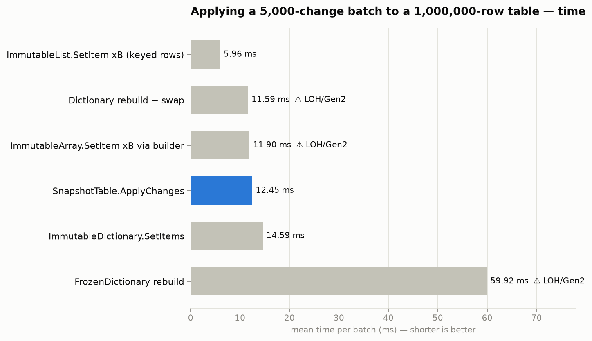
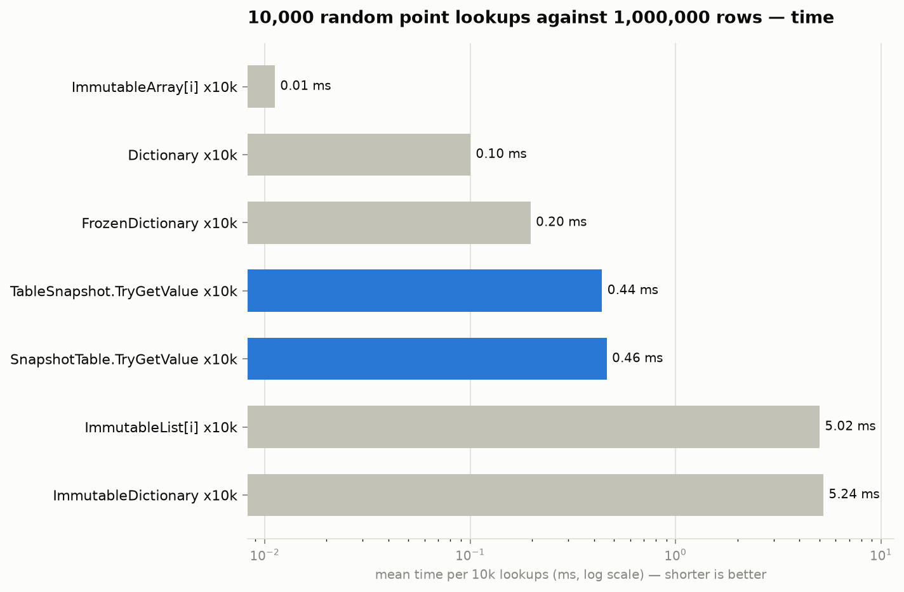
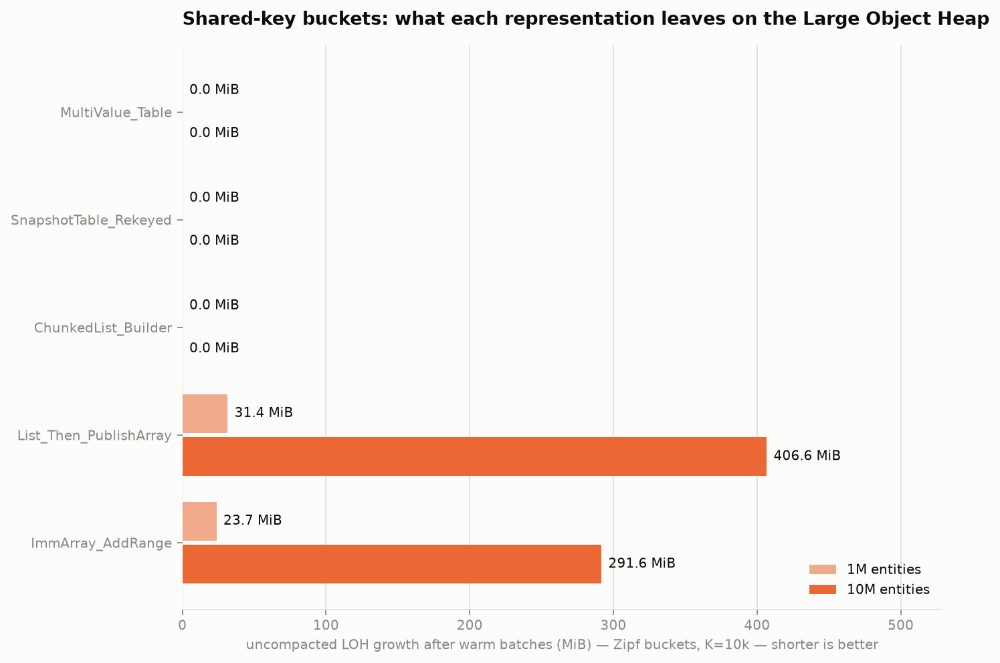

# dotnet-tools

High-performance building blocks for .NET services. First tool: **DotnetTools.SnapshotCache** —
low-allocation, LOH-friendly snapshot collections for large in-memory table caches.

## The problem

A common cache shape: tables with **millions of rows** held in memory, refreshed with a **batch of
changes every ~30 seconds**, and read constantly from many threads. Doing this with the BCL
immutable collections hurts in specific, measurable ways:

| Structure | What goes wrong at millions of rows |
|---|---|
| `ImmutableArray<T>` | Any update (`SetItem`, builder) copies the **entire** backing array — O(N) CPU per batch, and the array itself lives on the **Large Object Heap** (anything ≥ 85,000 bytes). Every 30 s you allocate another multi-MB LOH array → LOH fragmentation and expensive Gen2/full GCs. |
| `ImmutableList<T>` | A balanced binary tree: ~2 heap objects' worth of overhead (~40+ bytes) per element, O(log N) pointer-chasing per read (terrible cache locality), and every update allocates O(log N) new tree nodes. Memory footprint is typically 3–5× the raw data. |
| `ImmutableDictionary<K,V>` | Same story as `ImmutableList` (HAMT trie): lookups ~10× slower than `Dictionary`, high per-node overhead, heavy allocation churn on updates. |
| `Dictionary` rebuild + swap | Fast reads, but a full rebuild every 30 s is O(N) CPU + O(N) allocation, and the internal `_entries`/`_buckets` arrays of a million-entry dictionary are firmly on the LOH. |
| `FrozenDictionary<K,V>` | The fastest possible reads, but it is build-once: incorporating a batch means a full O(N) rebuild, with the same LOH-sized internal arrays. Great for tables that change rarely; wrong for a 30-second refresh cycle over millions of rows. |

## Performance at a glance

*BenchmarkDotNet on .NET 10, 4-core Linux VM. Full tables, methodology, and raw data in
[`benchmarks/RESULTS.md`](benchmarks/RESULTS.md). Absolute timings on a shared VM drift ~2× between
runs, so the **allocation / LOH / relative-ordering** columns are the ones to trust.*

**The 30-second refresh — 1,000,000 rows, 5,000-change batch, keyed by `long`:**

| Approach | Apply one batch | 10k point lookups | LOH per refresh | Steady-state memory |
|---|---:|---:|---:|---:|
| **`SnapshotTable`** | ~12 ms | ~63 ns/lookup | **0 bytes** | 2.3× raw |
| `Dictionary` rebuild + swap | ~12 ms | **~16 ns/lookup** | ~31 MB (LOH) | 2.4× raw |
| `FrozenDictionary` rebuild | ~60 ms | ~26 ns/lookup | ~98 MB (LOH) | 3.6× raw |
| `ImmutableDictionary.SetItems` | ~15 ms | ~651 ns/lookup | 0 bytes | 4.0× raw |
| `ImmutableArray` builder | ~12 ms | — *(positional only)* | ~30 MB (LOH) | 1.0× raw |

`SnapshotTable` is the only row that is **LOH-free on every refresh** *and* dictionary-class on
reads. A plain `Dictionary` reads ~4× faster — the honest price of lock-free consistent snapshots —
but pays an O(N) LOH rebuild each cycle; the immutable BCL collections avoid the LOH but read ~10×
slower at ~4× the memory. At the real target — **100,000,000 rows, 20,000 changes every 30 s** — no
BCL option completes the cycle cleanly, while `SnapshotTable` applies a batch in **~120 ms median
(Server GC, ≈0.4% of the budget)** with **0.0 MiB LOH growth** and **zero Gen2 collections** across
the run.

| Applying a 5k-change batch (1M rows) | 10k random point lookups (1M rows) |
|:---:|:---:|
|  |  |

**Shared key → many values (one-to-many buckets).** For the "one key → a list of entities, some
lists past the 85 KB LOH threshold" shape, `ChunkedImmutableList` and the packaged
`MultiValueSnapshotTable` hold **0 MiB LOH growth** over 100 warm batches, where
`ImmutableArray.AddRange` and `List → publish-array` leave **hundreds of MiB to gigabytes** of dead
large objects (details in [`benchmarks/RESULTS.md` §9–§13](benchmarks/RESULTS.md)). One caveat for
`MultiValueSnapshotTable`: cold-load the table with `Reset` or a single batched `ApplyChanges`, never
a per-key `ApplyChanges` loop (that path is O(N²) — see the type's section below):



## The solution in this repo

Two classes in [`src/DotnetTools.SnapshotCache`](src/DotnetTools.SnapshotCache) (plus
`MultiValueSnapshotTable<TKey, TEntity>` for the shared-key/one-to-many shape above):

### `ChunkedImmutableList<T>`

An immutable (persistent) list stored as small fixed-size **chunks** (default ~4 KB of data,
tunable per instance) reached through a **two-level spine** (8 KB spine blocks of 1024 chunk
references). Compared to `ImmutableArray`:

- **No LOH allocations at any size** — chunks, spine blocks, the top spine, and all builder
  bookkeeping (ownership bitsets) stay below the 85 KB threshold up to `int.MaxValue` elements.
  A 100-million-row list is ~390k small arrays, not one 1.6 GB array.
- **O(touched chunks) updates instead of O(N)** — `SetItem` copies one chunk + one spine block +
  the top spine; a **batch** through `ToBuilder()` copies each touched chunk and spine block at
  most once. Untouched structure is shared between the old and new version (structural sharing),
  so old snapshots stay valid for free.
- **Array-speed reads** — an index read is three array indexings, no tree traversal.
- **Array-speed *scans* too** — `Chunks` exposes each chunk as a `ReadOnlySpan<T>`, so a full
  scan runs as a handful of tight span loops (within ~3% of a contiguous `ImmutableArray`, vs the
  element-by-element enumerator's ~10–25% premium).
- **Adaptive chunk size** — `SnapshotTable` picks large (~64 KB) chunks for tables up to a few
  million rows (dense batches: fewer, larger copies win) and small (~4 KB) chunks for huge tables
  (sparse batches: 20k random updates over 100M rows copy ~65 MB instead of ~880 MB). Override
  with `SnapshotTableOptions.ChunkRows` / `EmptyWithChunkRows` if your batch pattern differs.

Usable as a standalone persistent list, with an `ImmutableArray`-like surface:

```csharp
var list = ChunkedImmutableList<int>.CreateRange(source);   // or .EmptyWithChunkRows(n)
var bigger = list.AddRange(moreItems);                        // O(touched chunks), shares the rest
int at = list.IndexOf(value);                                // span scan, EqualityComparer.Default
foreach (ReadOnlySpan<int> span in list.Chunks) { /* vectorize */ }
list.CopyTo(destinationSpan);                                // chunk-sized block copies

var builder = list.ToBuilder();                              // batch many edits, one publish
builder.AddRange(batch);
var next = builder.ToImmutable();                            // old `list` stays valid & unchanged
```

### `SnapshotTable<TKey, TValue>`

The cache class for the "big table + periodic batch refresh" pattern:

- **Wait-free reads.** Readers do one volatile load of the current snapshot; no locks, no torn
  state. `GetSnapshot()` hands out a fully immutable, internally consistent view — iterate a report
  over it while updates keep landing.
- **Atomic batch updates.** `ApplyChanges(upserts, removes)` builds the next snapshot with
  copy-on-write at two granularities — row chunks (via `ChunkedImmutableList`) and a **sharded hash
  index**: up to ~500k small `Dictionary<TKey,int>` shards reached through a two-level directory,
  every piece below the LOH threshold. Only shards containing *inserted or removed* keys (and
  their directory blocks) are cloned; in-place value updates never touch the index at all.
- **Cost proportional to the batch, not the table.** A 20,000-change batch over 100,000,000 rows
  copies ~90 MB of small-object chunks/shards instead of gigabytes — measured: 0.87 s median per
  batch, zero LOH growth (see `benchmarks/RESULTS.md`), against a 30-second budget.
- **Removals are O(1)** via swap-remove (last row moves into the vacated slot; iteration order is
  not stable across removes — irrelevant for keyed cache tables).
- **Compact index shards.** The key → row index uses custom open-addressing shards
  (~22 B/entry vs ~39 B/entry for `Dictionary<TKey,int>`), cutting total footprint from ~3.3× to
  ~2.3× the raw data at 100M rows.
- **Secondary indexes** (`CreateIndex(selector)`) maintained atomically inside every batch —
  query customers by region/status/tier from any snapshot, consistent with that snapshot.
- **Change notifications** — `SnapshotChanged` fires after each atomic swap with the upserted and
  removed keys, so downstream caches or projections can react without diffing.
- **Parallel initial load** — `ResetParallel` builds the index on all cores for unique-key streams
  (duplicate keys are detected and rejected).

```csharp
var customers = new SnapshotTable<long, Customer>(new SnapshotTableOptions<long>
{
    CapacityHint = 100_000_000,   // sizes the sharded index and picks the chunk size
    // ChunkRows = 256,           // optional: override the adaptive chunk-size default
});
var byRegion = customers.CreateIndex((id, c) => c.Region);  // optional secondary index
customers.ResetParallel(LoadAllFromDatabase());            // initial full load, all cores

customers.SnapshotChanged += change =>                     // optional change feed
    InvalidateDownstream(change.UpsertedKeys, change.RemovedKeys);

// every 30 seconds:
customers.ApplyChanges(upserts: changedRows, removes: deletedIds);  // O(batch), atomic

// hot path, any thread, no locks:
if (customers.TryGetValue(id, out var customer)) { ... }

// consistent multi-read / full scan / secondary index query:
var snap = customers.GetSnapshot();
foreach (var (id, customer) in snap) { ... }               // never sees a half-applied batch
foreach (var (id, customer) in snap.LookupRows(byRegion, "BR")) { ... }
```

### `MultiValueSnapshotTable<TKey, TEntity>`

The same guarantees for the **one key → many values** (one-to-many bucket) shape — e.g. an order
book keyed by instrument, or events keyed by tenant — where individual buckets can grow past the
LOH threshold. Each bucket is stored **hybrid**: a flat array while small (best reads), promoted
to a `ChunkedImmutableList` once it crosses ~1,024 entities, so warm appends to a hot bucket copy
one sub-LOH chunk instead of the whole list. Batches are atomic and wait-free to read, same as
`SnapshotTable`.

```csharp
var byInstrument = new MultiValueSnapshotTable<long, Order>(keyCapacityHint: 100_000);
byInstrument.Reset(initialBucketsPerInstrument);           // one-time load

byInstrument.ApplyChanges([                                 // atomic batch of bucket changes
    BucketChange.Append(instrumentId, newOrders),          //   append 1..N to a bucket
    BucketChange.ReplaceAt(instrumentId, (index, order)),  //   replace a position
    BucketChange.Remove<long, Order>(delistedId),          //   drop a whole bucket
]);

IReadOnlyList<Order> book = byInstrument.Lookup(instrumentId);  // wait-free, immutable
```

> **Cold-load batching is mandatory.** Populate the table with `Reset` (or one batched
> `ApplyChanges`), **never** a loop of one `ApplyChanges` call per key. Each `ApplyChanges` clones
> the shard directory and copy-on-writes every touched shard dictionary once, so a per-key loop is
> **O(N²)** in shard occupancy — the footgun that kept a production service unhealthy for 15+
> minutes ([issue #42](https://github.com/danieljoppi/dotnet-tools/issues/42)). Per-entity calls
> are fine only for small incremental refreshes. Guarded in CI by the `Category=Performance`
> cold-load test; measured across N in `ColdLoadBenchmarks` ([`RESULTS.md` §16](benchmarks/RESULTS.md)).

> **Keep refresh input lean.** For the incremental refreshes themselves, stream changes as a lazy
> `IEnumerable` (`keys.Select(k => BucketChange.Append(k, entity))`) rather than a materialized
> `BucketChange[]`, and use the single-entity `BucketChange.Append(key, entity)` overload — it holds
> the entity inline instead of allocating a one-element array per change
> ([`RESULTS.md` §17](benchmarks/RESULTS.md), issue #45).

Install from the packaged build (`dotnet pack src/DotnetTools.SnapshotCache`; CI uploads the
`.nupkg` as an artifact on every merge request, and pushing a `v*` tag publishes a GitHub Release —
see [`.github/workflows/release.yml`](.github/workflows/release.yml)).

## Do you need this, or does something off-the-shelf fit?

Checked before building (ordered from "try first"):

1. **`FrozenDictionary` (.NET 8+)** — if a table refreshes *rarely* (minutes/hours) or is small
   enough that an O(N) rebuild every 30 s is acceptable, rebuild + atomic reference swap is the
   simplest correct answer and has the fastest reads. It loses only when N is large **and** the
   refresh is frequent — exactly the workload here.
2. **Plain `Dictionary` + reference swap** — same trade-off, cheaper rebuild than frozen, slightly
   slower reads. Still O(N) per refresh and LOH-resident internals.
3. **[Microsoft FASTER / Garnet (Tsavorite)](https://github.com/microsoft/garnet)** — excellent
   larger-than-memory key-value store with checkpointing. Heavier operationally (log, sessions);
   worth it if you need persistence or data larger than RAM, overkill for a pure in-memory
   read-mostly table.
4. **[BitFaster.Caching](https://github.com/bitfaster/BitFaster.Caching)** — best-in-class
   `ConcurrentLru`/`ConcurrentLfu` for *eviction-style* caches (bounded size, hit-rate driven).
   Different problem: a reference table wants *all* rows resident, no eviction.
5. **`ConcurrentDictionary`** — fine for per-key mutation, but there are no consistent snapshots or
   atomic batches; readers can observe half-applied refreshes, and its internals also land on the LOH.

None of these gives *all three* of: O(batch) refresh cost, LOH-free steady state, and consistent
lock-free snapshots — which is why `SnapshotTable` exists.

### What about C++ / native code?

Not recommended, and not built here, deliberately:

- The pain (LOH churn, GC pauses, O(N) copies) comes from **allocation shape**, not from managed
  code being slow. Chunking + copy-on-write + snapshot swap removes the GC pressure while staying
  100% safe C#.
- P/Invoke costs ~1–10 ns per call and, worse, a native table returning managed-visible data means
  marshalling or pinning on every read — that overhead exceeds what a native hash map would save on
  a nanosecond-scale lookup.
- Modern .NET already offers the "native" escape hatches in-language when profiling demands them:
  `NativeMemory.Alloc` for unmanaged buffers of fixed-size structs (zero GC involvement),
  `struct`-of-arrays layouts, `Span<T>`/`Unsafe`, and NativeAOT. If a table of blittable rows ever
  needs to leave the GC heap entirely, that is the path — same performance as C++, no interop seam,
  no second toolchain, no cross-platform build matrix.

## Layout

```
src/DotnetTools.SnapshotCache/           the library (net8.0;net10.0, zero dependencies)
tests/DotnetTools.SnapshotCache.Tests/   xUnit: correctness, fuzz-vs-model, snapshot isolation,
                                         concurrency stress, LOH + performance guardrails (110+ tests)
benchmarks/DotnetTools.SnapshotCache.Benchmarks/   BenchmarkDotNet comparisons + LOH console studies
samples/Quickstart/                      runnable end-to-end example of all three types
```

Run the quickstart:

```bash
dotnet run --project samples/Quickstart
```

Changes are tracked in [`CHANGELOG.md`](CHANGELOG.md).

## Running tests and benchmarks

```bash
dotnet test tests/DotnetTools.SnapshotCache.Tests -c Release

# full benchmark run (slow, accurate):
dotnet run -c Release --project benchmarks/DotnetTools.SnapshotCache.Benchmarks -- --filter '*'

# quick pass:
dotnet run -c Release --project benchmarks/DotnetTools.SnapshotCache.Benchmarks -- --filter '*' --job short
```

The BenchmarkDotNet suite covers the unique-key workload — `InitialLoadBenchmarks` (full load),
`BatchUpdateBenchmarks` / `UniqueKeyBatchBenchmarks` (the every-30-seconds refresh, batch sizes
1k–50k with removes), and `ReadBenchmarks` (10k random point lookups) — each against
`ImmutableArray`, `ImmutableList`, `ImmutableDictionary`, `Dictionary` rebuild + swap, and
`FrozenDictionary` rebuild. The **shared-key / one-to-many** workload lives in
`SharedKeyBucketBenchmarks`, `LargeRefreshBenchmarks`, and `BucketReadBenchmarks`. Because
BenchmarkDotNet cannot report Large Object Heap *occupancy*, the LOH-size deltas that back the
headline claims come from console harnesses:

```bash
# LOH size before/after N warm batches, per approach (shared-key buckets):
dotnet run -c Release --project benchmarks/DotnetTools.SnapshotCache.Benchmarks -- --bucket-loh 1000000 10000 zipf 10

# end-to-end 100M-row / 20k-batch validation (load, apply, concurrent reads, LOH growth):
dotnet run -c Release --project benchmarks/DotnetTools.SnapshotCache.Benchmarks -- --largescale 100000000 20000 10
```

Full results, tables, and charts from this environment are in
[`benchmarks/RESULTS.md`](benchmarks/RESULTS.md); raw reports and harness logs under
[`benchmarks/results/raw/`](benchmarks/results/raw/).

## Guarantees & limits

- Chunk arrays, spine blocks, index shards, directory blocks, and per-batch bookkeeping all stay
  below the 85,000-byte LOH threshold by construction (tested), up to `int.MaxValue` rows.
  Validated with a real 100M-row / 20k-batch run: zero LOH growth, zero Gen2 collections
  (`benchmarks/RESULTS.md` §4). The same holds for `MultiValueSnapshotTable` and secondary-index
  buckets, whose lists promote to `ChunkedImmutableList` before any bucket array could reach the
  LOH — hot 100k-member buckets append at O(chunk) cost with zero LOH growth (RESULTS.md §9).
- One writer at a time (writers serialize on a lock; readers never block). Designed for the
  single-refresher pattern, not for high-frequency per-key contention.
- Iteration order is insertion order until a remove occurs (swap-remove); treat enumeration as
  unordered, like a dictionary.
- `TableSnapshot` instances pin the chunks/shards of their version; drop them when done so old
  versions can be collected. Holding one snapshot costs only the *delta* vs the current version.
