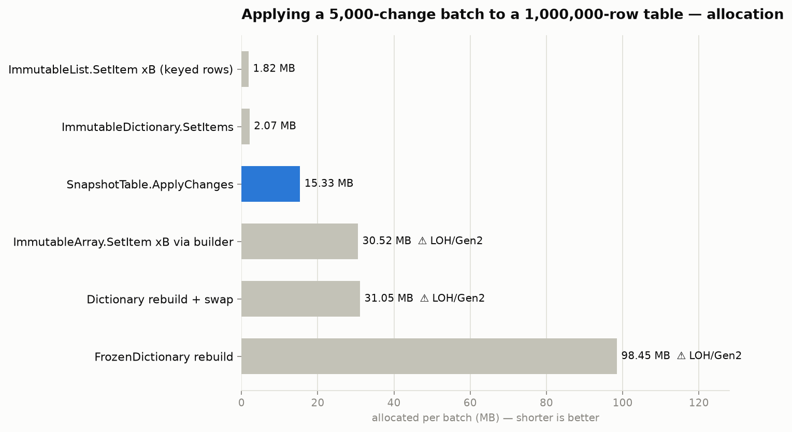
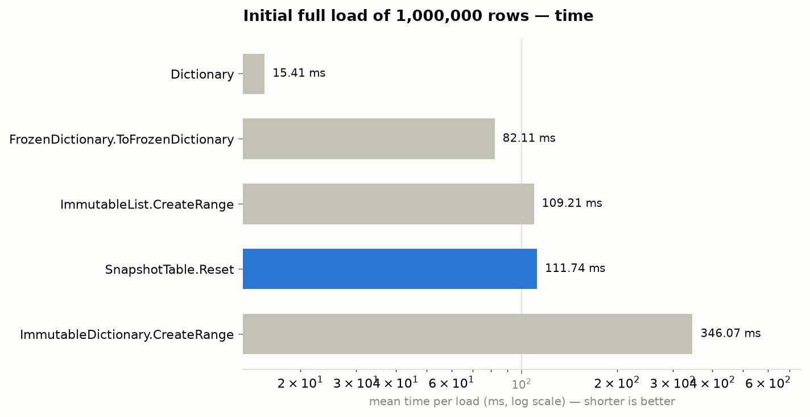
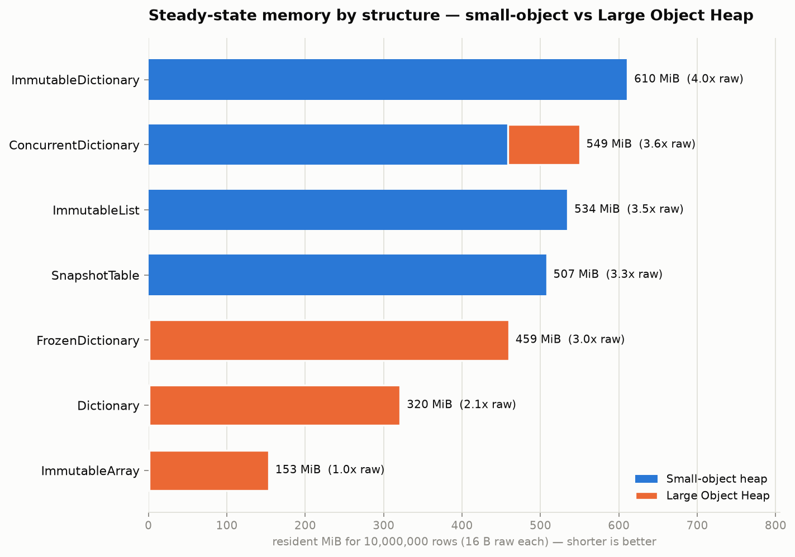

# Benchmark results

Measured with BenchmarkDotNet 0.15.8 (`--job short --memory`, 3 warmup + 3 measurement
iterations) on this environment:

```
Linux Ubuntu 24.04.4 LTS, Intel Xeon 2.10GHz, 4 physical cores
.NET SDK 10.0.110, .NET 10.0.10, X64 RyuJIT x86-64-v4, Concurrent Workstation GC
```

ShortRun numbers are indicative; re-run without `--job short` for publication-grade statistics.
**Environment variance caveat**: this is a shared cloud VM whose absolute timings drift up to ~2x
between sessions (the identical `Dictionary rebuild` code measured 11.4-14.8 ms across runs).
Relative ordering and the allocation/GC columns are stable across every run and are the numbers
to trust. Raw reports (CSV + markdown) are in [`results/raw/`](results/raw/), the plotting script
is [`plot_results.py`](plot_results.py).

## Scenario counts (what each benchmark actually does)

The suite models the real workload — a large table in memory, refreshed in batches, read hot:

| Phase | Counts | Benchmark class |
|---|---|---|
| Initial full load | 1,000,000 rows inserted once | `InitialLoadBenchmarks` |
| Periodic refresh (the every-30-seconds batch) | 5,000 upserts, keys uniformly random over the 1M key space | `BatchUpdateBenchmarks` |
| Hot read path | 10,000 random point lookups per invocation | `ReadBenchmarks` |
| Batch-size sweep with removes (§11) | 1k / 10k / 50k upserts, 0% / 10% removes, mid-width row | `UniqueKeyBatchBenchmarks` |
| Shared-key one-to-many buckets (§9) | 1M entities over 10k / 100k shared keys, uniform + Zipf | `SharedKeyBucketBenchmarks` |
| Bucket read path (§9) | 10k hot-weighted indexed reads + full 1M-entity scans | `BucketReadBenchmarks` |
| Single large refresh over skewed buckets (§10) | ~12k entity ops across 800 of 2,000 keys, 15 LOH-sized buckets | `LargeRefreshBenchmarks` |

Row type for the batch scenario: `record Row(long Id, string Name, decimal Balance, DateTime UpdatedAt)`
keyed by `long`. Read/load scenarios use `long → long` to isolate structure cost from row size.

> **Core-version note**: sections 1–3 were measured on the v0.1 core (`Dictionary`-based index
> shards, 870 ms apply at 100M). Sections 2 and 4–7 reflect the current v0.2 core (compact
> open-addressing shards, parallel load); v0.2 is equal or better on every metric.

## 1. The 30-second refresh batch (the reason this library exists)




| Method | Mean | Allocated | Gen2/LOH collections |
|---|---:|---:|---:|
| ImmutableList.SetItem ×B (keyed rows)¹ | 5.96 ms | 1.82 MB | 0 |
| Dictionary rebuild + swap | 11.59 ms | 31.05 MB | yes |
| ImmutableArray.SetItem ×B via builder | 11.90 ms | 30.52 MB | yes — full array copy on LOH |
| **SnapshotTable.ApplyChanges** | **12.45 ms** | 15.33 MB | **0** |
| ImmutableDictionary.SetItems | 14.59 ms | 2.07 MB | 0 |
| FrozenDictionary rebuild | 59.92 ms | 98.45 MB | yes |

¹ Flattered: charged only for row replacement, assuming a free pre-existing key→index map —
maintaining that index is exactly what `SnapshotTable` does and `ImmutableList` doesn't.

**How to read this**: at 1M rows a uniformly random 5k batch touches nearly every 64 KB chunk, so
`SnapshotTable`'s apply time lands in the same band as an O(N) rebuild — the batch is simply not
sparse relative to this table. Its differentiators at this scale are the columns, not the row:
**zero Gen2/LOH activity** (every full-rebuild option hits the LOH each cycle) and dictionary-class
reads (the two structures that allocate less per batch, `ImmutableList`/`ImmutableDictionary`,
read ~9-11× slower and carry 3-5× the steady-state memory). The apply-time advantage grows with
table size as the batch becomes sparse: at 100M rows it is ~5× faster than a rebuild could ever be
(section 4) — and clustered (non-random) batches copy proportionally less at any scale.

## 2. Point lookups (hot path)


| Method | Mean (10k lookups) | Per lookup | Allocated |
|---|---:|---:|---:|
| ImmutableArray[i]² | 11.0 μs | ~1 ns | 0 |
| Dictionary | 157 μs | ~16 ns | 0 |
| FrozenDictionary | 261 μs | ~26 ns | 0 |
| **TableSnapshot.TryGetValue** | **586 μs** | **~59 ns** | **0** |
| **SnapshotTable.TryGetValue** | **632 μs** | **~63 ns** | **0** |
| ImmutableList[i] | 7,059 μs | ~706 ns | 0 |
| ImmutableDictionary | 6,506 μs | ~651 ns | 0 |

² Positional index only — not a keyed lookup; included as the raw-array speed floor.

The honest trade-off: a plain `Dictionary` reads ~4× faster per lookup (~16 ns vs ~63 ns; the
extra cost is the shard-directory hop plus the chunked-row hop). That premium buys lock-free
consistent snapshots and LOH-free refreshes. Against the structures it replaces
(`ImmutableList`/`ImmutableDictionary`) it reads **~10× faster**. (Measured on the v0.2
open-addressing shard core.)

## 3. Initial full load (one-time cost)



| Method | Mean | Allocated |
|---|---:|---:|
| Dictionary | 15.4 ms | 31.05 MB |
| FrozenDictionary.ToFrozenDictionary | 82.1 ms | 139.35 MB |
| ImmutableList.CreateRange | 109.2 ms | 53.41 MB |
| **SnapshotTable.Reset** | **111.7 ms** | **54.52 MB** |
| ImmutableDictionary.CreateRange | 346.1 ms | 61.04 MB |

Load is `SnapshotTable`'s weakest phase (~7× a raw `Dictionary` fill), but it happens once at
startup and shards are pre-sized from `CapacityHint`, so allocation is now only ~1.8× the raw
data. At 100M rows the measured load rate is 1.4M rows/s (section 4).

## 4. The target workload: 100,000,000 rows, 20,000 changes every 30 seconds

Run end-to-end with the console harness (`--largescale`), workstation GC, 4-core Linux VM, while
two reader threads continuously issued point lookups. Batch mix: 80% updates of random existing
rows, 20% inserts of new rows. Full output: [`results/raw/largescale-100m.txt`](results/raw/largescale-100m.txt).

| Metric | Workstation GC | Server GC | Budget / context |
|---|---:|---:|---|
| Initial load (`ResetParallel`, one-time) | 11.8 s (8.5M rows/s) | 9.6 s (10.4M rows/s) | was 72.5 s in v0.1 |
| Heap for 100M rows + index | **3.38 GiB** | **3.38 GiB** | 2.26× raw data |
| **LOH size after load** | **0.0 MiB** | **0.0 MiB** | entirely small-object |
| Apply 20k-change batch (median) | 452 ms | **80 ms** | 30,000 ms budget |
| Allocation per batch | ~83 MiB, Gen0/Gen1 only | ~83 MiB | vs multi-GiB LOH for rebuilds |
| **LOH growth over 10 cycles** | **0.0 MiB** | **0.0 MiB** | the headline guarantee |
| Concurrent reads during refreshes | 2.45 M lookups/s | 2.48 M lookups/s | readers never block |

Full outputs: [`largescale-100m.txt`](results/raw/largescale-100m.txt),
[`largescale-100m-servergc.txt`](results/raw/largescale-100m-servergc.txt). Production services
should run Server GC, where the batch apply drops to ~80 ms — 0.3% of the budget.

At this scale no BCL alternative completes the workload cleanly: `ImmutableArray` would copy a
1.6 GB LOH array per batch, a `Dictionary`/`FrozenDictionary` rebuild would allocate ~5 GiB of
LOH-resident structures every 30 seconds, and `ImmutableList`/`ImmutableDictionary` would need
roughly 3-5x the memory and ~11x slower reads.

The structure itself is LOH-free by construction at any row count up to `int.MaxValue`: row chunks
(~4 KB), spine blocks (8 KB), index shards (a few KB each, ~500k of them), directory blocks
(8 KB), and all copy-on-write bookkeeping (bitsets) sit far below the 85,000-byte threshold.

## 5. Overall memory analysis: steady-state footprint and where it lives

Speed and per-batch allocation only tell half the story — this measures what each structure
*costs to keep resident*, and how much of that sits on the Large Object Heap. Method: build the
structure holding N `long → long` rows in a fresh process, force a full compacting GC (including
explicit LOH compaction), and report live heap deltas. Raw data: 16 B/row. CSV:
[`results/raw/memory-footprint.csv`](results/raw/memory-footprint.csv), harness: `--memory-profile`.



| Structure | 1M rows | 10M rows | 100M rows | On LOH | Keyed reads (§2) | 30 s refresh (§1/§4) |
|---|---:|---:|---:|---|---:|---|
| ImmutableArray | 16 MiB (1.0×) | 153 MiB (1.0×) | 1.49 GiB (1.0×) | **100%** | positional only | O(N) LOH copy |
| Dictionary | 37 MiB (2.4×) | 320 MiB (2.1×) | 5.01 GiB (3.4×)² | **~100%** | ~14 ns | O(N) LOH rebuild |
| FrozenDictionary | 55 MiB (3.6×) | 459 MiB (3.0×) | 2.61 GiB (1.75×) | **~100%** | ~29 ns | O(N) LOH rebuild, slowest |
| **SnapshotTable** | **36 MiB (2.26×)** | **365 MiB (2.28×)** | **3.38 GiB (2.26×)** | **0%** | ~70 ns | **O(batch), no LOH** |
| ImmutableList | 53 MiB (3.5×) | 534 MiB (3.5×) | 5.22 GiB (3.5×) | 0% | no key index³ | O(touched nodes) |
| ConcurrentDictionary | 56 MiB (3.7×) | 549 MiB (3.6×) | 5.90 GiB (4.0×) | partial (buckets) | ~fast | per-key only, no snapshots |
| ImmutableDictionary | 61 MiB (4.0×) | 610 MiB (4.0×) | 5.96 GiB (4.0×) | 0% | ~585 ns | O(B log N) |

¹ All seven structures were also measured at the 100M tier (the earlier report only ran the
top candidates there). Per-row cost is scale-invariant for every structure — `ImmutableArray`
stays exactly 1.0× raw at 100M and works as a *read-only* container at any size; what rules it
out for this workload is unchanged at every scale: 100% LOH residency from ~85 KB upward, a full
O(N) LOH copy per refresh (1.49 GiB per batch at 100M), and no keyed lookup.
² `Dictionary` built from an enumerable (no count) grows by prime-doubling and lands over-sized —
at 100M rows its capacity overshoot alone wastes ~1.5 GiB. Pre-sizing fixes that but does not get
it off the LOH.
³ `ImmutableList` needs a separate key→index map for keyed access; add one `Dictionary` row above
to its cost for a fair keyed-workload comparison (which also puts it on the LOH).

**What the overall picture says:**

- **Every structure with dictionary-class read speed except `SnapshotTable` keeps its bulk on the
  LOH** — `Dictionary`, `FrozenDictionary`, `ConcurrentDictionary` (buckets), `ImmutableArray`.
  Their steady-state *size* is fine; the problem is that their refresh path reallocates those
  LOH structures every cycle, which is what fragments the LOH and drives Gen2/full GCs.
- **The LOH-free BCL options pay for it in reads and per-element overhead**:
  `ImmutableDictionary`/`ImmutableList` are 3.5-4× raw with ~9× slower lookups.
- **`FrozenDictionary` is the most compact keyed structure at scale** (1.75× raw at 100M — its
  arrays are exactly sized). If a table refreshes rarely and a 100%-LOH resident footprint is
  acceptable, it is the best read-mostly choice; its disqualifier here is the 30-second full
  rebuild (~2.6-5 GiB of LOH churn per cycle at 100M).
- **`SnapshotTable` sits at 3.25-3.6× raw — the same band as the BCL keyed structures — with 0%
  on the LOH at every scale**, and it is the only one whose refresh cost doesn't scale with the
  table. Most of its footprint is the sharded key→row index (~35 B/row of `Dictionary` entries);
  the row store itself is only ~1.05× raw. A denser custom shard (open addressing, int-only) could
  cut total to ~2× raw if memory ever becomes the binding constraint — tracked as a possible
  follow-up, not needed to meet the current budget (4.84 GiB for 100M rows fits comfortably).

### Why steady-state size misleads: the churn analysis

`ImmutableArray`'s 1.0× footprint makes it look like the winner above — until the 30-second
cadence enters the analysis. Resident size is what a structure holds *between* refreshes; a cache
is judged by what happens *at* each refresh:

| Per-cycle behavior (100M rows, every 30 s) | ImmutableArray | SnapshotTable |
|---|---:|---:|
| Newly allocated per refresh | **1.49 GiB, all LOH** | ~83 MiB, all small-object |
| Peak during refresh (old + new alive) | ~3 GiB | ~3.5 GiB (only +83 MiB is new) |
| Garbage generated per hour (120 cycles) | **~180 GiB through the LOH** | ~10 GiB through Gen0/Gen1 |
| Reclaimed by | full/Gen2 collections (pause the app) | cheap ephemeral GCs |

~180 GiB/hour of LOH turnover is the disease this library exists to cure: the LOH is not
compacted by default, so it fragments, and reclaiming it takes the full collections that pause
every request. And the 1.49 GiB is not the real total anyway — `ImmutableArray` has no keyed
lookup, so a real cache pairs it with a `Dictionary<TKey,int>` index (multi-GiB, ~100% LOH at
100M, see the table above) that must also be maintained. The honest totals for a keyed workload:

- `ImmutableArray` + required index: **~4.5–6.5 GiB, nearly all LOH, churned every 30 s**
- `SnapshotTable` (index included): **3.38 GiB, 0% LOH, ~83 MiB touched per refresh**

**Rule of thumb**: `ImmutableArray` is the right tool for load-once, read-only, positional data
at any size — its compactness there is unbeatable. For a keyed table on a refresh cadence it
loses on every metric the cadence touches. Section 8 measures how far tuning can push it.

## 6. Soak: 400 refresh cycles under load

`--soak`: 20M rows, 400 cycles of 20k changes (70% update / 15% insert / 15% remove), two reader
threads, and a rotating window of 5 held old snapshots simulating in-flight reports. Full output:
[`soak-20m-400.txt`](results/raw/soak-20m-400.txt).

| Metric | Measured |
|---|---:|
| Managed heap after 400 cycles | **flat: 696 → 696 MiB** (+1 MiB) |
| **Table LOH growth** | **0.0 MiB** |
| Apply p50 / max | 112 ms / 364 ms |
| Reads sustained throughout | 1.63 M lookups/s |
| Verdict | **PASS** — no fragmentation creep, no leak through held snapshots |

(The few MiB of transient LOH visible at mid-run checkpoints belong to the harness's own
unbounded removed-keys `Queue`, not the table; it collects to zero at the end.)

## 7. Production-shaped rows (strings + decimal payload)

`RealisticRowBenchmarks`: 1M rows of `record CustomerRow(long Id, string Name, string Email,
string Region, decimal Balance, int Status, DateTime CreatedAt, DateTime UpdatedAt)`, 5k-change
batches in both key distributions. Raw: [`results/raw/`](results/raw/).

| Method | Mean | Allocated | Gen2/LOH |
|---|---:|---:|---:|
| **SnapshotTable, clustered 5k batch** | **0.49 ms** | **137 KB** | 0 |
| **SnapshotTable, random 5k batch** | **7.9 ms** | 15.7 MB | 0 |
| Dictionary rebuild + swap | 28.5 ms | 31.8 MB | yes |
| FrozenDictionary rebuild | 88.1 ms | 100.8 MB | yes |

With reference-type rows the rebuild approaches slow down (every entry is a pointer the GC must
trace through LOH-resident arrays) while `SnapshotTable` pulls further ahead — and **clustered
batches, the common shape of real change feeds, cost 16× less than random ones** (137 KB per
refresh) because consecutive keys share chunks.

## 8. Investigation: can the ImmutableArray approach be improved?

Measured with `--immutablearray-study` (10M rows, 20k-change batch, 15 cycles per variant, p50;
raw output: [`immutablearray-study.txt`](results/raw/immutablearray-study.txt)):

| Variant | Apply p50 | Alloc/cycle | Gen2 in 15 cycles | Caveat |
|---|---:|---:|---:|---|
| Naive `ToBuilder`/`ToImmutable` | 70 ms | 305 MiB (LOH) | 9 | two full copies, fresh LOH array every cycle |
| Builder + `MoveToImmutable` | 36 ms | 153 MiB (LOH) | 5 | the *safe* single-copy publish — see finding 2 |
| `GC.AllocateUninitializedArray` + `AsImmutableArray` | 18 ms | 153 MiB (LOH) | 5 | one copy, skips zeroing — still one LOH alloc/cycle |
| Extract (`AsArray`) + mutate in place | ~0 ms | 0 | 0 | **no atomicity at all** — see finding 4 |
| **Pooled double-buffer + `AsImmutableArray`** | **18 ms** | **0** | **0** | see finding 3 |
| SnapshotTable.ApplyChanges (reference) | 64 ms | 62 MiB (SOH) | 3 | — |

**Findings, honestly stated:**

1. **Yes, it can be improved — dramatically.** `ImmutableCollectionsMarshal.AsImmutableArray`
   lets two persistent buffers alternate: copy current → standby, apply the batch, wrap, swap.
   Zero steady-state allocation, zero Gen2, and at 10M rows the linear 160 MB memcpy (18 ms) is
   actually *faster* than SnapshotTable's scattered chunk copies (65 ms). Sequential memory
   bandwidth is hard to beat.
2. **Builder + `MoveToImmutable` is the best *fully safe* variant.** `CreateBuilder(N)` +
   `AddRange` + apply + `MoveToImmutable()` publishes the builder's array by ownership transfer —
   no second copy, real immutability, half the naive cost (36 ms vs 70 ms). But it still allocates
   one N-sized LOH array every cycle (153 MiB here, 1.49 GiB at 100M), so the churn disease — the
   reason this analysis exists — is halved, not cured. If a team must stay on ImmutableArray with
   zero safety compromises, this is the ceiling: ~2× faster, same LOH cadence.
3. **What the double-buffer trick costs.** (a) *Immutability becomes a promise, not a guarantee*: the array
   behind a published "immutable" snapshot is silently overwritten one cycle later, so no reader
   may hold a snapshot across a refresh — one slow report holding last cycle's view reads torn
   data. (b) *No keyed lookup*: the paired `Dictionary` index is still multi-GiB LOH, and keeping
   it consistent with in-place buffer swaps reintroduces the coherence problem the snapshot design
   solves. (c) *Growth reallocates*: inserts beyond capacity force new LOH buffers.
   (d) *O(N) copy time per cycle regardless of batch size*: ~18 ms at 10M scales to ~200+ ms at
   100M and grows linearly forever, while SnapshotTable's 80 ms (Server GC) tracks the batch, not
   the table.
4. **Extract-and-mutate is not an ImmutableArray design at all.** `AsArray` + in-place writes is
   the fastest possible (sub-millisecond, zero alloc) because it skips the copy entirely — and
   with it every guarantee: readers observe half-applied batches *during* the write, and the
   "immutable" value everyone holds silently changes. It is a plain mutable array wearing an
   `ImmutableArray` type signature. Legitimate only when readers tolerate incoherent views
   (some telemetry caches do); never for a table where a report must see one consistent version.
5. **Verdict**: for a *positional, fixed-size, updates-only* table whose consumers never hold a
   snapshot across a cycle, a double-buffered flat array is an excellent design — and if that is
   your workload, use it. The moment you need keyed lookup, safe long-lived snapshots, inserts/
   removes, or table sizes where O(N) copies bite, each fix you bolt on walks the design one step
   closer to chunked copy-on-write — which is `SnapshotTable`. That is not a coincidence:
   `ChunkedImmutableList` *is* the improved ImmutableArray.

## 9. Shared key → many values: one-to-many buckets (Workload B, issue #6)

Everything so far keyed rows uniquely. A second production shape keeps **buckets**: one shared
key → a list of entities, with heavy skew (a few keys hold 10k–100k+ entities). An array of
10,625+ references crosses the 85,000-byte LOH threshold, so every full-copy update of a hot
bucket is a Large Object allocation. `SharedKeyBucketBenchmarks` + the `--bucket-loh` console
study measure four bucket representations under one harness:

| Name | Store per shared key | Warm update |
|---|---|---|
| `ImmArray_AddRange` | `ImmutableArray<Entity>` | `AddRange` (appends) / single-copy patch (replaces) |
| `List_Then_PublishArray` | mutable `List<Entity>` master | mutate in place, publish one array per touched key |
| `ChunkedList_Builder` | `ChunkedImmutableList<Entity>` | builder → `ToImmutable`, copies only touched chunks |
| `SnapshotTable_Rekeyed` | one table, `(groupId, entityId) → entity` | one `ApplyChanges` batch |

Population: 1M (and 10M) mid-width entities (`record Entity(long Id, long GroupId, int Kind,
int Version, string Label, decimal Amount, DateTime UpdatedAt)`) over K = 10k / 100k shared keys,
sized uniformly or Zipf (s=1 — at K=10k/N=1M the hottest bucket holds ~102k entities ≈ 800 KB as
a reference array; 9 buckets sit past the LOH bar, 96 at N=10M). Warm batch: touch ~1% of keys
(sampled ∝ bucket size under skew — the hot keys are the ones that keep changing); per touched
key either append 1–50 entities or replace ~1% of the bucket.

### Batch cost (BenchmarkDotNet, ShortRun, medians; state restored between iterations)

| K / skew | ImmArray_AddRange | List_Then_PublishArray | ChunkedList_Builder | SnapshotTable_Rekeyed |
|---|---:|---:|---:|---:|
| 10k / Uniform (buckets ≈100) | **149 μs / 91 KB** | 162 μs / 91 KB | 485 μs / 1.24 MB | 4.1 ms / 11.0 MB |
| 10k / Zipf (hot ≈102k) | 1.31 ms / 3.24 MB | 1.03 ms / 3.24 MB | **0.77 ms / 2.06 MB** | 4.9 ms / 13.0 MB |
| 100k / Uniform (buckets ≈10) | **0.88 ms / 199 KB** | 0.99 ms / 199 KB | 4.8 ms / 12.4 MB | 29.5 ms / 45.7 MB |
| 100k / Zipf | 2.39 ms / 4.06 MB | **1.73 ms / 4.06 MB** | 4.8 ms / 14.2 MB | 37.4 ms / 48.6 MB |

(Timings on this shared VM carry the usual ~2× session noise — `Allocated` and the LOH table
below are the stable columns.)

### The LOH columns (`--bucket-loh`, 10 warm batches, workstation GC, forced-compaction deltas)

Zipf, K=10k — **1M entities**:

| Approach | LOH after build | LOH after 10 batches (uncompacted) | LOH after forced Gen2+compact | Extra heap retained by holding the pre-cycle snapshot |
|---|---:|---:|---:|---:|
| ImmArray_AddRange | 2.2 MiB | **23.7 MiB** | 4.4 MiB | 7.3 MiB |
| List_Then_PublishArray | 4.4 MiB | **31.4 MiB** | 10.0 MiB | 7.3 MiB |
| **ChunkedList_Builder** | **0.0 MiB** | **0.0 MiB** | **0.0 MiB** | 14.4 MiB |
| **SnapshotTable_Rekeyed** | **0.0 MiB** | **0.0 MiB** | **0.0 MiB** | 52.3 MiB |

Zipf, K=10k — **10M entities** (hottest bucket ~1.02M entities ≈ 7.8 MiB per copy):

| Approach | LOH after build | LOH after 10 batches (uncompacted) | LOH after forced Gen2+compact | Batch median |
|---|---:|---:|---:|---:|
| ImmArray_AddRange | 40.1 MiB | **291.6 MiB** | 79.4 MiB | 14.1 ms |
| List_Then_PublishArray | 80.2 MiB | **406.6 MiB** | 159.9 MiB | 92.6 ms |
| **ChunkedList_Builder** | **0.0 MiB** | **0.0 MiB** | **0.0 MiB** | 27.6 ms |
| **SnapshotTable_Rekeyed** | **0.0 MiB** | **0.0 MiB** | **0.0 MiB** | 289.0 ms |

Full outputs, including the uniform controls (where nothing touches the LOH and the array
approaches win everything): [`bucket-loh-1m-10k-zipf.txt`](results/raw/bucket-loh-1m-10k-zipf.txt),
[`bucket-loh-10m-10k-zipf.txt`](results/raw/bucket-loh-10m-10k-zipf.txt),
[`bucket-loh-1m-10k-uniform.txt`](results/raw/bucket-loh-1m-10k-uniform.txt),
[`bucket-loh-1m-100k-uniform.txt`](results/raw/bucket-loh-1m-100k-uniform.txt).

**Pass criteria from the ticket, checked:**

- ✅ **Chunked / Snapshot: LOH growth ≈ 0 on skewed keys with bucket payload ≥ 85 KB** — measured
  exactly 0.0 MiB at every scale, uncompacted and compacted, 10 batches.
- ✅ **`ImmArray_AddRange`: a large LOH step** — +21.5 MiB uncompacted (1M), +251 MiB (10M) over
  10 batches; the LOH only returns toward baseline after a *forced* Gen2 with LOH compaction,
  which .NET does not run on its own.
- ✅ **`List_Then_PublishArray`: one LOH alloc per large touched key per batch** — and it is the
  *worst* LOH citizen here, not a mitigation: mutating the master list costs nothing, but every
  publish materializes a fresh full-size array, so hot buckets put **two** copies (master `List`
  backing array + published array) on the LOH and re-publish per batch (uncompacted step +27 MiB
  at 1M, +326 MiB at 10M — larger than `AddRange`, which at least reuses nothing).

### Honest costs on the other side

- **Small buckets don't want chunks.** With uniform ~10–100-entity buckets the array approaches
  beat `ChunkedList_Builder` on every column (91 KB vs 1.24 MB per batch at K=10k). A
  `ChunkedImmutableList` instance also carries a fixed spine overhead (~8 KB spine block + top
  spine): at K=100k the chunked store's build heap is **1.30 GiB vs 125 MiB** for arrays
  (~11.7 KB/bucket of pure overhead). Chunking pays off only once buckets can grow past a few
  thousand entities.
- **Scattered wide replaces approach a full copy.** Replacing 1% of a 100k-entity bucket at
  random indexes touches nearly all of its 512-row chunks, so the chunked copy volume converges
  on the array copy — still allocated as sub-LOH chunks (the guarantee holds), but the "extra
  retained by held snapshot" column (14.4 vs 7.3 MiB) shows the copied-chunk overhead. Appends
  and clustered replaces are where structural sharing shines.
- **`SnapshotTable_Rekeyed` buys atomicity, not speed.** One `ApplyChanges` gives a consistent
  cross-key snapshot and point reads by `(groupId, entityId)`, at 3–10× the batch cost of the
  chunked buckets and the highest snapshot-retention cost (index shards + directory clones). Note
  it answers "get *one* entity" — enumerating *all* entities of a group needs a secondary index,
  and the current secondary index copies its bucket per change (documented for buckets up to the
  low thousands), so it is **not** suitable for 10k+ entity groups. See API gaps below.

### The read side — what the LOH win costs per lookup and per scan

Reads are the path a cache serves all day, so the batch/LOH tables above are only half the
decision (ADR-0005). `BucketReadBenchmarks` measures the same populations read-only (no state
restore → stable timings, zero allocation on every row):

| Access pattern (1M entities, K=10k) | ImmutableArray | ChunkedImmutableList | SnapshotTable_Rekeyed |
|---|---:|---:|---:|
| 10k random indexed reads, hot-weighted (Zipf) | **222 μs (~22 ns)** | 448 μs (~45 ns, 2.0×) | 1,230 μs (~123 ns, 5.5×) |
| 10k random indexed reads (Uniform) | **270 μs (~27 ns)** | 707 μs (~71 ns, 2.6×) | 1,240 μs (~124 ns, 4.6×) |
| Scan all 1M entities (Zipf) | **8.6 ms (~8.6 ns/entity)** | 12.2 ms (~12 ns, 1.4×) | n/a — needs group index (#9) |
| Scan all 1M entities (Uniform) | **7.6 ms (~7.6 ns/entity)** | 11.6 ms (~12 ns, 1.5×) | n/a |

Raw: [`BucketReadBenchmarks-report-github.md`](results/raw/DotnetTools.SnapshotCache.Benchmarks.BucketReadBenchmarks-report-github.md).

How to read it: the chunked list's three-array-hop indexer costs ~2–2.6× a contiguous array on
random access, and sequential scans — the aggregation/report path — pay a milder 1.4–1.5× because
the enumerator only re-resolves a chunk every 512 elements. The rekeyed table pays the full
shard-directory + chunk hop per lookup (~123 ns, consistent with §2) and cannot enumerate one
group at all without the secondary index (#9). None of the read premiums allocate. This is the
quantified case for the hybrid recommendation below: keep small buckets as arrays (best reads,
LOH unreachable), pay the chunked read premium only where the alternative is LOH churn.

### Recommendation: which shape fits which store

| Your buckets | Use |
|---|---|
| Reliably small (≤ ~2k entities, payload « 85 KB) | `ImmutableArray.AddRange` or `List` → publish — cheapest on every metric, LOH never involved |
| Can grow past ~10k references / 85 KB (skewed one-to-many) | `ChunkedImmutableList` builder per bucket — zero LOH at any size, O(touched chunks) batches, cheap held snapshots for append-shaped churn |
| Real Zipf population (most buckets tiny, a hot head) | Hybrid: arrays below a size threshold, switch a bucket to `ChunkedImmutableList` when it crosses (~2k entities); avoids the ~10 KB/bucket chunk overhead where it buys nothing |
| Need atomic multi-key batches, consistent snapshots, keyed point reads | `SnapshotTable` re-keyed to `(sharedKey, uniqueKey)` — highest batch cost, zero LOH, wait-free readers |

### API gaps found (candidate follow-ups)

1. **No shared-key/multi-value helper.** The winning pattern (dictionary of per-key
   `ChunkedImmutableList` + hybrid small-bucket representation + atomic publish) is hand-rolled
   in this harness; a `MultiValueSnapshotTable<TKey, TEntity>` packaging it would close the gap.
2. **`ChunkedImmutableList` fixed per-instance overhead** (~8 KB+ even for a 10-element list)
   makes it wasteful as a per-bucket store at high K — a compact representation for lists that
   fit in one chunk would remove the 10× build-heap penalty measured at K=100k.
3. **`Builder` has no `AddRange`** — bulk appends go through per-item `Add`.
4. **Secondary-index buckets are flat copied arrays** — fine for the documented
   moderate-cardinality use, unusable as a group index for 10k+ entity buckets (each entity
   add/remove would copy a LOH-sized key array). A chunked bucket representation would make
   `SnapshotTable` + group index a complete answer for this workload.

## 10. Single large refresh over skewed buckets (Workload C)

One batch of **~12k entity operations across 800 of 2,000 keys** (touched keys weighted to the
hot head; alternating append-shaped and replace-shaped keys) against a population where 15 buckets already hold 30k
entities (234 KB as reference arrays — past the LOH bar) and the rest hold ~350.
`LargeRefreshBenchmarks` + `--bucket-loh 1000000 2000 refresh 10`:

| Approach | Batch (BDN median) | Allocated | LOH after 10 refreshes (uncompacted) | LOH compacted | Gen2+compact pause |
|---|---:|---:|---:|---:|---:|
| ImmArray_AddRange | 2.5 ms | 5.19 MB | 9.4 MiB | 6.9 MiB | 201 ms |
| List_Then_PublishArray | **1.9 ms** | 5.19 MB | **35.5 MiB** | 13.7 MiB | 260 ms |
| ChunkedList_Builder | 3.5 ms | 11.05 MB | **0.0 MiB** | **0.0 MiB** | 233 ms |
| SnapshotTable_Rekeyed | 27.2 ms | 43.14 MB | **0.0 MiB** | **0.0 MiB** | 234 ms |

Same verdict at refresh-event scale: the array approaches are faster per event, and every event
deposits another layer of dead LOH-sized arrays that only a forced compacting Gen2 (≈200–260 ms
pause at this heap size) claws back; the chunked structures pay ~1.5–2× the wall time, allocate
~2× the bytes — all of it ephemeral small-object garbage that ordinary Gen0/Gen1 collections
recycle with zero LOH involvement. Raw: [`bucket-loh-1m-refresh.txt`](results/raw/bucket-loh-1m-refresh.txt).

## 11. Batch-size sweep with removes (Workload A extension)

`UniqueKeyBatchBenchmarks`: N=1M mid-width rows, B ∈ {1k, 10k, 50k} uniformly random upserts,
0% or 10% of B removed in the same batch, warm steady state (each batch re-inserts what the
previous one removed). ShortRun medians, 0%-removes rows shown (10% adds ~15–25% to
`SnapshotTable` and is invisible for the rebuild approaches — full tables in
[`results/raw/`](results/raw/DotnetTools.SnapshotCache.Benchmarks.UniqueKeyBatchBenchmarks-report-github.md)):

| Method | B=1k | B=10k | B=50k | Allocated (1k → 50k) | LOH |
|---|---:|---:|---:|---:|---|
| SnapshotTable.ApplyChanges | 15.8 ms | 14.0 ms | 33.9 ms | 15.0 → 15.3 MB (flat) | none |
| + held snapshot across batch | 14.9 ms | 14.1 ms | 18.4 ms | identical | none |
| Dictionary rebuild + swap | 12.8 ms | 24.2 ms | 14.4 ms | 31.0 MB (flat) | yes, every batch |
| ImmutableDictionary.SetItems | **1.6 ms** | 27.4 ms | 104.9 ms | 0.55 → 11.7 MB (∝B) | none |
| FrozenDictionary rebuild | 70.0 ms | 81.5 ms | 91.8 ms | ~98 MB (flat) | yes, every batch |

What the sweep shows:

- **`SnapshotTable`'s batch cost is capacity-shaped, not B-shaped, once random batches saturate
  the chunks.** At 1M rows there are only ~244 64 KB chunks, and a uniformly random 1k batch
  already lands in ~98% of them — so 1k, 10k and 50k batches all copy essentially every chunk
  and cost the same ~14–34 ms / ~15 MB. This is the saturation worst case by design; sparse
  batches (large N, §4) and clustered change feeds (§7: 16× less) are where O(batch) shows.
- **`ImmutableDictionary` is the small-batch champion** (1.6 ms at B=1k, pure O(B log N)) — the
  reason it still loses the workload is §2: its reads are ~10× slower and its resident footprint
  4× raw, paid on every lookup all day long.
- **Holding the previous snapshot across a batch is free on the timing side** (identical
  medians/allocation; the retained-memory side is §9's "extra retained" column) — the structural
  sharing claim, now measured in the sweep too.
- **Cold loads**: `ResetParallel` cuts the 1M-row cold load from 101 ms to **34 ms** (§3 table
  re-measured this run; `Dictionary` fill remains 13 ms, `FrozenDictionary` 78 ms with a 139 MB
  LOH bill).

## Reproducing

```bash
# full statistics (slow):
dotnet run -c Release --project benchmarks/DotnetTools.SnapshotCache.Benchmarks -- --filter '*'

# what produced these numbers:
dotnet run -c Release --project benchmarks/DotnetTools.SnapshotCache.Benchmarks -- --filter '*' --job short --memory

# regenerate the charts from the artifacts:
python3 benchmarks/plot_results.py

# steady-state memory profile (one structure per process):
dotnet benchmarks/DotnetTools.SnapshotCache.Benchmarks/bin/Release/net10.0/DotnetTools.SnapshotCache.Benchmarks.dll --memory-profile SnapshotTable 10000000

# shared-key bucket workloads (§9-§11):
dotnet run -c Release --project benchmarks/DotnetTools.SnapshotCache.Benchmarks -- --filter '*SharedKeyBucket*' --job short --memory
dotnet run -c Release --project benchmarks/DotnetTools.SnapshotCache.Benchmarks -- --filter '*BucketRead*' --job short --memory
dotnet run -c Release --project benchmarks/DotnetTools.SnapshotCache.Benchmarks -- --filter '*LargeRefresh*' --job short --memory
dotnet run -c Release --project benchmarks/DotnetTools.SnapshotCache.Benchmarks -- --filter '*UniqueKeyBatch*' --job short --memory

# LOH size / retention study behind the §9-§10 tables (entities, keys, skew, cycles):
dotnet run -c Release --project benchmarks/DotnetTools.SnapshotCache.Benchmarks -- --bucket-loh 1000000 10000 zipf 10
dotnet run -c Release --project benchmarks/DotnetTools.SnapshotCache.Benchmarks -- --bucket-loh 10000000 10000 zipf 10
dotnet run -c Release --project benchmarks/DotnetTools.SnapshotCache.Benchmarks -- --bucket-loh 1000000 2000 refresh 10
```
