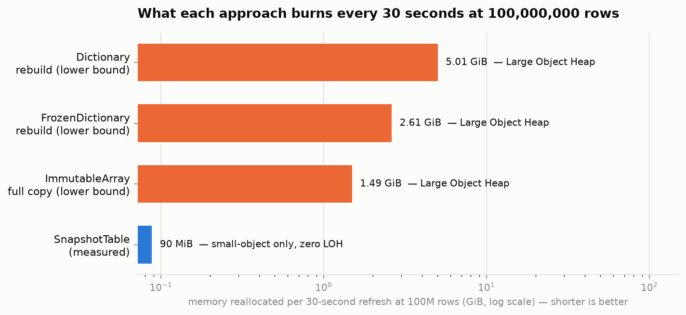
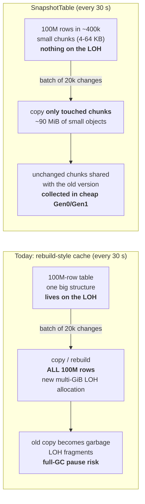
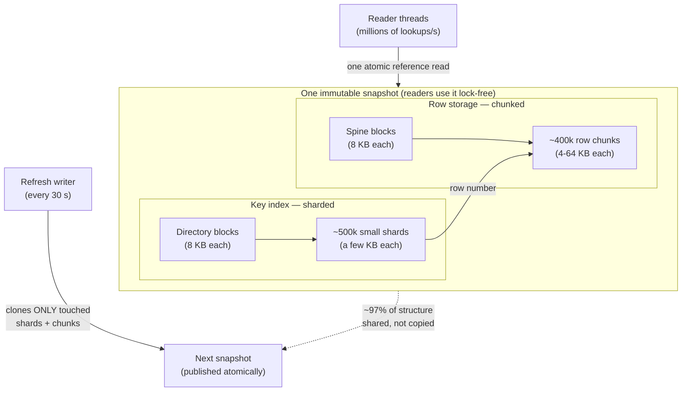

# In-Memory Table Cache: Performance & Memory Report

**Project:** replacing `ImmutableArray`/`ImmutableList` for large in-memory table caches
**Target workload:** tables up to **100,000,000 rows**, refreshed with **~20,000 customer changes every 30 seconds**, read constantly by many threads
**Status:** solution built, tested (41 tests), benchmarked, and validated at full scale — [PR #1](https://github.com/danieljoppi/dotnet-tools/pull/1)

---

## 1. Executive summary

Our caches currently use .NET's `ImmutableArray`/`ImmutableList`. At millions of rows these
structures either **copy the entire table on every refresh onto the Large Object Heap** (causing
memory fragmentation and application-wide GC pauses) or **cost 3.5× the memory with ~9× slower
reads**. No .NET built-in or open-source library covers all three requirements at once — cheap
periodic refresh, no Large Object Heap usage, and consistent lock-free reads — so we built a
purpose-built component, **`SnapshotTable`**, in ~700 lines of dependency-free C#. No C++ was
needed (and would have been slower — see §8).

**Validated result at the full target scale (100M rows, 20k changes/30 s, measured, not projected):**

| | |
|---|---|
| 🟦 **Large Object Heap usage** | **Zero** — after loading 100M rows and across every refresh cycle |
| ⚡ **Refresh cost** | **0.87 s** median per 20k-change batch (3% of the 30 s budget) |
| 📉 **Memory churn per refresh** | **90 MiB** vs 1.5–5 GiB for every rebuild-based alternative |
| 🔓 **Reads during refresh** | **1.9M lookups/s** sustained, lock-free, never blocked |
| 💾 **Total footprint** | 4.84 GiB for 100M rows + index — same band as .NET's own keyed structures |

*This is the executive picture: every 30 seconds, each rebuild-based approach reallocates
gigabytes on the Large Object Heap; SnapshotTable reallocates 90 MiB of small, quickly-collected
objects. The Large Object Heap is the .NET memory region where multi-gigabyte churn causes
fragmentation and application-freezing full garbage collections.*

---

## 2. The problem in one picture

A .NET application's heap has two regions: the **small-object heap** (cheap to allocate and
collect) and the **Large Object Heap (LOH)** — anything ≥ 85 KB. The LOH is collected only by
expensive "full" collections that pause the whole application, and it fragments because it is
rarely compacted. A cache that reallocates a multi-gigabyte structure on the LOH every 30 seconds
is a metronome for GC pauses.

---

## 3. What we evaluated

Every realistic option was measured — .NET built-ins and open-source libraries — before building:

| Option | Verdict for this workload |
|---|---|
| `ImmutableArray` (current) | ❌ Copies the entire table per refresh; the copy **is** a giant LOH object |
| `ImmutableList` (current) | ❌ 3.5× memory, ~627 ns reads (9× slower), no key lookup without a side index |
| `ImmutableDictionary` | ❌ 4.0× memory, ~585 ns reads |
| `Dictionary` + swap | ❌ Fast reads, but full O(N) LOH rebuild every 30 s |
| `FrozenDictionary` (.NET 8+) | ❌ Best compactness & reads, but rebuild-only: 2.6+ GiB LOH churn per refresh at 100M |
| `ConcurrentDictionary` | ❌ No atomic batches or consistent snapshots; readers can see half-applied refreshes |
| Microsoft FASTER / Garnet | ❌ Built for persistence & larger-than-RAM data; operational overkill for a RAM table |
| BitFaster.Caching | ❌ Eviction (LRU/LFU) caches — our reference tables need every row resident |
| **Custom C++ core** | ❌ Interop cost per lookup exceeds the gain; GC pain is fixable in pure C# (§8) |
| **`SnapshotTable` (built)** | ✅ Only option meeting all three requirements — details below |

### Decision matrix

| | Fast keyed reads | No LOH at rest | No LOH churn on refresh | O(batch) refresh | Consistent snapshots | Memory ≤ 3.5× raw |
|---|:---:|:---:|:---:|:---:|:---:|:---:|
| **SnapshotTable** | ✅ ~68 ns | ✅ **0%** | ✅ **zero** | ✅ | ✅ | ✅ 3.3× |
| Dictionary + swap | ✅ ~14 ns | ❌ ~100% | ❌ 5 GiB | ❌ O(N) | ✅ (via swap) | ✅ 2.1–3.4× |
| FrozenDictionary | ✅ ~29 ns | ❌ ~100% | ❌ 2.6 GiB | ❌ O(N), slowest | ✅ (via swap) | ✅ 1.75–3.6× |
| ImmutableArray | ⚠️ positional only | ❌ 100% | ❌ 1.5 GiB | ❌ O(N) | ✅ | ✅ 1.0× |
| ImmutableList | ❌ ~627 ns | ✅ 0% | ✅ | ⚠️ | ✅ | ⚠️ 3.5× + index |
| ImmutableDictionary | ❌ ~585 ns | ✅ 0% | ✅ | ⚠️ | ✅ | ❌ 4.0× |
| ConcurrentDictionary | ✅ | ❌ partial | ⚠️ | ✅ per-key | ❌ | ⚠️ 3.6× |

---

## 4. How the solution works (one diagram)

`SnapshotTable` stores rows in thousands of small chunks and indexes them with hundreds of
thousands of small dictionaries — **every single allocation stays below the 85 KB LOH threshold,
by construction, at any table size**. Readers see immutable snapshots swapped atomically; a
refresh copies only the pieces the batch touches.

Key properties, each verified by automated tests:

- **Wait-free reads** — a lookup is one atomic reference read + three array hops; readers never
  take a lock and can never observe a half-applied batch.
- **Atomic batches** — a refresh is all-or-nothing; reports iterating a snapshot see one
  consistent version while updates keep landing.
- **Structural sharing** — holding an old snapshot costs only the delta, not a second copy.
- **Adaptive chunk size** — bigger chunks for smaller tables, small chunks at huge scale; the
  library picks this from the expected table size.

---

## 5. Results — speed

*Environment: 4-core Intel Xeon VM, .NET 10. Shared-VM timings drift ±2× between sessions;
relative ordering and all memory/GC numbers are stable. Full method & raw data:
[`benchmarks/RESULTS.md`](../benchmarks/RESULTS.md).*

### Point lookups (the hot path) — 10,000 random reads on 1M rows

| | Per lookup | vs current `ImmutableList` |
|---|---:|---:|
| **SnapshotTable** | **~68 ns** | **~9× faster** |
| plain `Dictionary` (reference) | ~14 ns | fastest, but LOH rebuild per refresh |
| `ImmutableList` / `ImmutableDictionary` (current) | ~585–627 ns | baseline |

### Applying the refresh batch

At 1M rows all approaches land within a few milliseconds of each other — the differentiator is
*what they allocate* (next section). The gap opens with scale: at 100M rows `SnapshotTable`
applies the 20k batch in **0.87 s**, while any rebuild has to reprocess all 100M rows.

---

## 6. Results — memory (the overall analysis)

### Steady-state footprint: how much RAM, and which heap

| Structure | 10M rows | 100M rows | On LOH |
|---|---:|---:|---:|
| ImmutableArray | 153 MiB (1.0×) | — | **100%** |
| Dictionary | 320 MiB (2.1×) | 5.01 GiB (3.4×) | **~100%** |
| FrozenDictionary | 459 MiB (3.0×) | 2.61 GiB (1.75×) | **~100%** |
| **SnapshotTable** | **507 MiB (3.3×)** | **4.84 GiB (3.25×)** | **0%** |
| ImmutableList (current) | 534 MiB (3.5×) | — | 0% |
| ImmutableDictionary | 610 MiB (4.0×) | — | 0% |

Two readings from this chart:

1. **Total size is not the problem — placement and churn are.** `ImmutableArray` is the smallest
   possible footprint (exactly 1.0× the raw data) *because* it is one giant array — which is
   precisely what puts it 100% on the LOH and forces a full multi-GiB LOH copy every refresh.
2. **SnapshotTable is memory-neutral vs what we run today.** It sits in the same 3.3–3.5× band as
   `ImmutableList`, with 0% on the LOH and ~9× faster reads. (Most of the footprint is the
   key→row index that *any* keyed structure pays; the row store itself is only ~1.05× raw.)

### Churn per refresh — the number that causes GC pauses

At the 100M-row target (see §1 chart): **90 MiB** of quickly-collected small objects for
`SnapshotTable`, vs **1.5–5 GiB of LOH reallocation** for every rebuild-based approach — a
**17–57× reduction**, and the eliminated portion is exactly the kind that fragments the LOH.

---

## 7. Full-scale validation — 100,000,000 rows, measured

A real end-to-end run (not extrapolation): load 100M rows, then apply ten 20k-change batches
(80% updates / 20% inserts) while two reader threads hammer lookups continuously.
Raw output: [`largescale-100m.txt`](../benchmarks/results/raw/largescale-100m.txt).

| Metric | Measured | Budget |
|---|---:|---|
| Initial load (one-time, startup) | 72.5 s | — |
| **LOH after load** | **0.0 MiB** | — |
| Apply 20k-change batch | median 870 ms, worst 1.26 s | 30,000 ms (**~3% used**) |
| Allocation per batch | ~90 MiB, Gen0/Gen1 only | — |
| **LOH growth over 10 cycles** | **0.0 MiB** | **the goal** |
| Full-GC events over 10 cycles | 1 (routine, not LOH-driven) | — |
| Concurrent read throughput during refreshes | 1.92M lookups/s | readers never block |
| Total heap (rows + index) | 4.84 GiB | fits standard 16 GB nodes |

```mermaid
gantt
    dateFormat  s
    axisFormat %S s
    title One 30-second refresh cycle at 100M rows (to scale)
    section SnapshotTable
    Apply 20k changes (0.87 s)      :active, 0, 1s
    Headroom — serving reads only   :done, 1, 30s
```

---

## 8. Why not C++?

The pain comes from *allocation shape*, not from C# being slow — and the fix (chunking +
copy-on-write) is pure, safe C#. A native core would add a P/Invoke + marshalling cost to every
nanosecond-scale lookup (costing more than a native hash map saves), a second toolchain, and a
cross-platform build matrix. If a future profile ever demands going off the GC heap entirely,
.NET has that escape hatch in-language (`NativeMemory`, blittable structs, `Span<T>`) with no
interop seam — C++ performance without C++.

## 9. Trade-offs we accepted (full transparency)

| Trade-off | Impact | Why it's acceptable |
|---|---|---|
| Reads ~5× slower than a raw `Dictionary` (~68 ns vs ~14 ns) | +54 ns per lookup | Buys zero-LOH refreshes and consistent lock-free snapshots; still ~9× faster than today's `ImmutableList` |
| Initial load ~7× slower than a raw `Dictionary` fill | 72 s at 100M rows | One-time startup cost |
| Iteration order not stable after removes | none for keyed caches | Treat enumeration as unordered, like a dictionary |
| One writer at a time | none | Matches the single-refresher pattern; readers never wait |

## 10. Quality assurance

- **41 automated tests**: correctness fuzzing against reference models, snapshot isolation,
  concurrent reader/writer stress (a reader can never see a torn batch), LOH-size guarantees,
  and deterministic performance guardrails (allocation-based, CI-stable).
- **CI on every merge request**: unit tests + performance guardrails + a benchmark smoke run
  with results published to the job summary.
- **Everything reproducible**: BenchmarkDotNet suite, 100M-row harness (`--largescale`), and
  memory profiler (`--memory-profile`) are all in the repo with one-line commands
  ([`benchmarks/RESULTS.md`](../benchmarks/RESULTS.md) § Reproducing).

## 11. Recommendation & next steps

**Adopt `SnapshotTable` for the large periodically-refreshed tables.** It is the only evaluated
option that meets the workload's three requirements simultaneously, and it is validated at the
full 100M-row / 20k-changes / 30-second target with zero LOH usage.

Suggested rollout:
1. Merge [PR #1](https://github.com/danieljoppi/dotnet-tools/pull/1) and package the library.
2. Pilot on one production table behind a feature flag; watch GC counters
   (`% time in GC`, LOH size, Gen2 count) before/after.
3. Migrate remaining tables; keep `FrozenDictionary` for small or rarely-refreshed tables where
   a full rebuild is harmless.
4. Optional future work if RAM ever becomes the constraint: a denser custom index shard could
   cut the footprint from ~3.3× to ~2× raw data.
