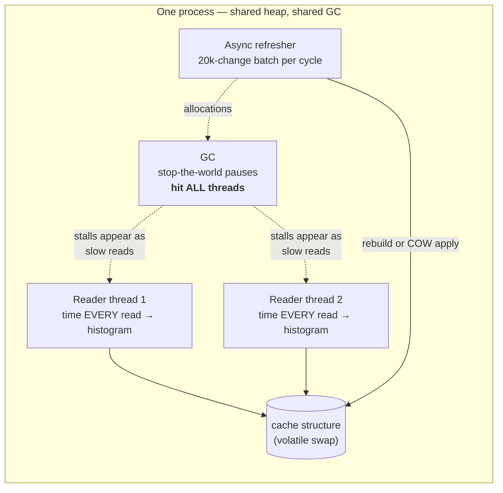
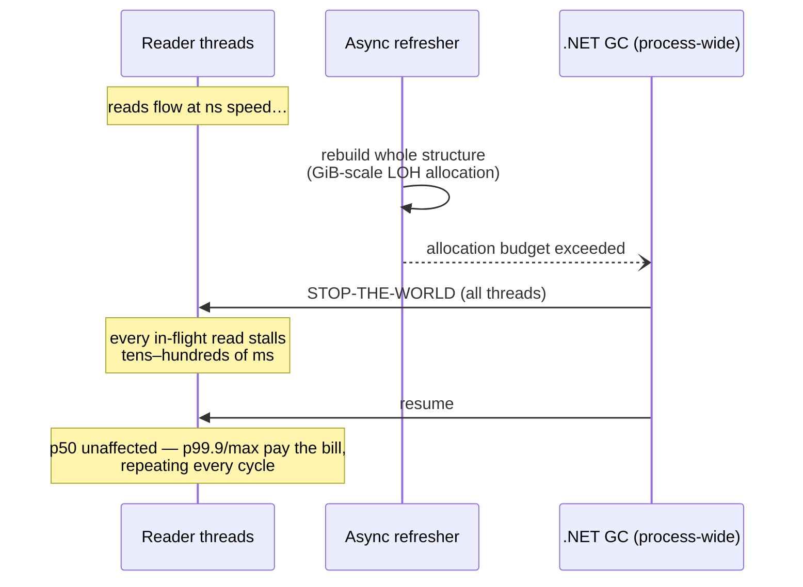

# Tail-Latency Analysis: Fast Reads vs. the Async Refresh

**Question under test:** *"If the major goal is fast reads, and the cache refresh happens every
30 seconds asynchronously — shouldn't we just pick the structure with the fastest reads?"*

**Method:** measure not the average read (per-op benchmarks answer that) but the **distribution**
— what the slowest reads look like while the refresh actually runs. Two reader threads time
**every individual read** (`Stopwatch.GetTimestamp`, 100 ns histogram resolution) while an
asynchronous refresher applies a 20,000-change batch on its own thread, exactly the production
shape. Harness: `--tail-latency` in the benchmarks project; raw output:
[`tail-latency.txt`](../benchmarks/results/raw/tail-latency.txt).

**Cadence compression:** at 10M rows a refresh every 3 s gives the same rebuild-to-cycle duty
ratio as the real 100M-row / 30 s workload, so eight variants fit in minutes. The 100M section
then validates at the true scale and cadence. Environment: shared 4-core cloud VM — single
worst-case `max` values carry scheduling noise (a descheduled reader looks like a slow read);
the percentile columns and GC-pause totals are the trustworthy signal.

---

## 1. Results — 10M rows, refresh every 3 s

### Workstation GC

| Variant | Reads/s | p50 | p99 | p99.9 | max | reads >1 ms | GC pause total | Gen2 |
|---|---:|---:|---:|---:|---:|---:|---:|---:|
| SnapshotTable | 2.74M | 650 ns | 1.1 µs | **6.8 µs** | 22.9 ms | **47** | **375 ms** | **3** |
| FrozenDictionary | 4.56M | **350 ns** | **650 ns** | 10.5 µs | 95.3 ms | 31 | 783 ms | 13 |
| ImmutableList | 1.33M | 1.4 µs | 2.5 µs | 18.5 µs | 74.8 ms | 199 | 221 ms | 1 |
| ImmutableArray² | 22.46M | 50 ns | 50 ns | 50 ns | 54.7 ms | 69 | 195 ms | 18 |

### Server GC (production mode)

| Variant | Reads/s | p50 | p99 | p99.9 | max | reads >1 ms | GC pause total | Gen2 |
|---|---:|---:|---:|---:|---:|---:|---:|---:|
| SnapshotTable | 2.75M | 650 ns | 1.1 µs | **7.3 µs** | 68.2 ms¹ | 171 | 228 ms | **1** |
| FrozenDictionary | 4.37M | **350 ns** | **750 ns** | 11.5 µs | 21.8 ms | **36** | **191 ms** | 21 |
| ImmutableList | 1.33M | 1.4 µs | 2.2 µs | 19.5 µs | 26.8 ms | 374 | 33 ms | 0 |
| ImmutableArray² | 22.70M | 50 ns | 50 ns | 50 ns | 136.3 ms | 72 | 383 ms | 26 |

¹ Scheduling artifact on the shared VM (see method note); SnapshotTable's Workstation max was 22.9 ms.
² Positional index reads, no key lookup — included as the raw-speed floor, not a like-for-like cache.

### What the 10M numbers say — honestly

1. **The GC heartbeat is real but modest at this scale.** FrozenDictionary's rebuild forced a
   Gen2 collection roughly every other cycle (13–21 vs SnapshotTable's 1–3) and produced the
   predicted stalls (95 ms worst on Workstation GC). But on **Server GC its pause total (191 ms
   over 60 s) matched SnapshotTable's** — at 10M rows / ~480 MB rebuilds, the .NET Server GC
   genuinely absorbs the churn well. **The theory held at Workstation GC (783 ms vs 375 ms of
   pauses, 2× worse) but at this scale Server GC neutralized most of the difference.**
2. **FrozenDictionary reads faster where it matters least, ties where it matters most.** It wins
   p50/p99 (350/650 ns vs 650 ns/1.1 µs — fewer memory indirections), while SnapshotTable wins
   p99.9 in both modes. Both keep every percentile under 12 µs.
3. **ImmutableList is the worst of all worlds** for this workload: slowest median (1.4 µs), worst
   p99.9 (≈19 µs), most >1 ms stalls (199–374) — the AVL tree pays cache misses on every hop.
4. **ImmutableArray's positional reads are astonishingly flat** (50 ns at every percentile — a
   single array indexing prefetches perfectly) — but its rebuild produced the most Gen2
   collections (18–26) and the single worst stall of the study (136 ms), and it still answers
   no keyed query.

---

## 2. Results — 100M rows, the real 30-second cadence (Server GC)

The 10M run showed Server GC absorbing ~0.5 GB rebuilds; the target workload rebuilds ~2.6 GiB
per cycle. Head-to-head of the two keyed contenders at the true scale and cadence, 240 s ≈ 8
refresh cycles:

<!-- 100M-TABLE -->

<!-- 100M-FINDINGS -->

---

## 3. The mechanism, in one diagram

The "async" in *async refresh* isolates the rebuild's **CPU** from readers, but its
**allocations** land on the shared heap, and collections pause every thread in the process. A
copy-on-write refresh (SnapshotTable) allocates ~30× less per cycle and none of it on the LOH,
which is why its Gen2 count stays at 0–3 while rebuild designs accumulate one per cycle or two.

## 4. Verdict for "fast reads is the major goal"

| If your table is… | …and reads are the priority | Why |
|---|---|---|
| ≤ ~10M rows, Server GC | **`FrozenDictionary` + async rebuild is legitimate** — measured, not conceded | 2× faster p50, pause totals on par with SnapshotTable at this scale |
| ≤ ~10M rows, Workstation GC | `SnapshotTable` | Frozen's pause total was 2× worse (783 vs 375 ms/min) |
| ~100M rows (the target) | see §2 measured verdict | rebuild churn grows 10×; COW cost stays O(batch) |
| Positional, fixed-size, no keys | `ImmutableArray` double-buffer ([RESULTS §8](../benchmarks/RESULTS.md)) | 50 ns flat reads — if you can live within its constraints |
| Anything | never `ImmutableList` | slowest median *and* worst tail simultaneously |

*Method files: [`TailLatencyStudy.cs`](../benchmarks/DotnetTools.SnapshotCache.Benchmarks/TailLatencyStudy.cs).
Reproduce: `dotnet run -c Release --project benchmarks/DotnetTools.SnapshotCache.Benchmarks -- --tail-latency <Variant> <rows> <seconds> <batch> <refreshMs>`.*
